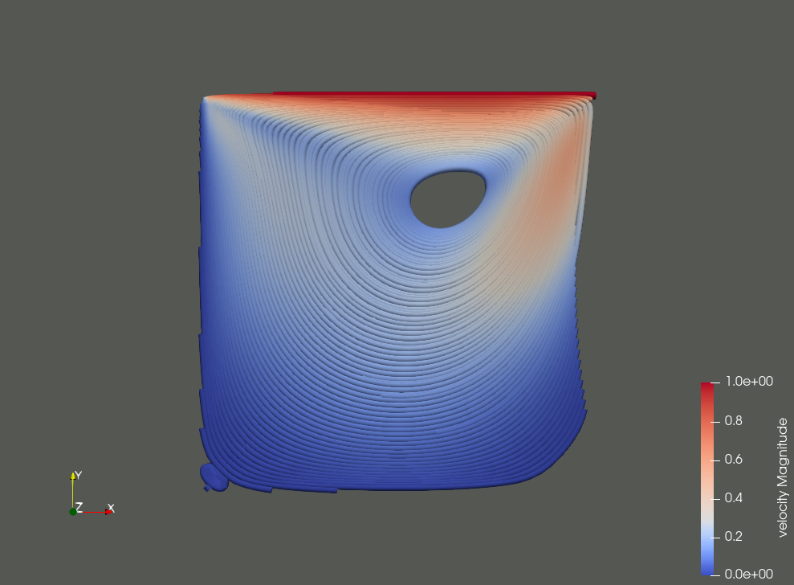

<div align="center">
  
</div>

Fluidchen is a CFD Solver developed for the CFD Lab taught at TUM Informatics, Chair of Scientific Computing in Computer Science.

## Software Requirements

This code is known to work on all currently supported Ubuntu LTS versions (22.04, 20.04, 18.04).
In particular, you will need:

- A recent version of the GCC compiler. Other compilers should also work, but you may need to tweak the CMakeLists.txt file (contributions welcome). GCC 7.4, 9.3, and 11.2 are known to work. See `CMakeLists.txt` and `src/Case.cpp` for some compiler-specific code.
- CMake, to configure the build.
- The VTK library, to generate result files. libvtk7 and libvtk9 are known to work.
- OpenMPI (not for the skeleton, but when you implement parallelization).

Get the dependencies on Ubuntu:

```shell
sudo apt-get update
sudo apt-get upgrade
sudo apt-get install build-essential cmake libvtk7-qt-dev openmpi-bin libopenmpi-dev
```

## Building the code

```shell
git clone https://gitlab.lrz.de/oguzziya/GroupE_CFDLab.git
cd GroupE_CFDLab
mkdir build && cd build
cmake ..
make
```

After `make` completes successfully, you will get an executable `fluidchen` in your `build` directory. Run the code from this directory.
Note: Earlier versions of this documentation pointed to the option of `make install`. You may want to avoid this and directly work inside the repository while you develop the code.

### Build options

By default, **fluidchen** is installed in `DEBUG` mode. To obtain full performance, you can execute cmake as

```shell
cmake -DCMAKE_BUILD_TYPE=RELEASE ..
```

or

```shell
cmake -DCMAKE_CXX_FLAGS="-O3" ..
```

You can see and modify all CMake options with, e.g., `ccmake .` inside `build/` (Ubuntu package `cmake-curses-gui`).

A good idea would be that you setup your computers as runners for [GitLab CI](https://docs.gitlab.com/ee/ci/)
(see the file `.gitlab-ci.yml` here) to check the code building automatically every time you push.

## Running

In order to run **Fluidchen**, the case file should be given as input parameter.
Some default case files are located in the `example_cases` directory. Navigate to the `build/` directory and run:

```shell
./fluidchen ../example_cases/LidDrivenCavity/LidDrivenCavity.dat
```

This will run the case file and create the output folder `../example_cases/LidDrivenCavity/LidDrivenCavity_Output`, which holds the `.vtk` files of the solution.

If the input file does not contain a geometry file (added later in the course), fluidchen will run the lid-driven cavity case with the given parameters.

Additionally, by specifying an integer parameter after the file path, one can create a seperate group of VTK files.
This way multiple simulations can be stored in the output folder for multiple such integer parameters.
These multiple simulations are stored as multiple groups that can be later opened in paraview.
eg. The following creates a 2nd group of VTK files with changed parameters in the dat file (if the user has changed any). 
```shell
./fluidchen ../example_cases/LidDrivenCavity/LidDrivenCavity.dat 2
```
All the input parameters of the simulations and convergence results are stored as a log file in the output directory with the name "Lid_Driven_Cavity" followed by the integer parameter. For instance after running the above shell command, a log file with the name "Lid_Driven_Cavity_run_rog_2" is created in `../example_cases/LidDrivenCavity/` directory.

### Cases with special obstacles or boundary conditions

An extra parameter with name "geo_file" needs to be provided to handle cases with obstacles or heated walls or cold walls or adiabatic walls. If no geo_file 
parameter is provided in the .dat file, the LidDriven Cavity with the parameters in the .dat file would be run automatically. 

The user should maintain consistency between the .pgm file with obstacles clearly defined and should have the same number of discretizations in all directions in the .dat. The user should ensure that they use the same numbering in .pgm and in .dat file. For example, if adiabatic wall has number 4 in .pgm file, they should ensure that the adiabatic wall is wall_temp_5 in .dat file. If the pgm file has 80 points in x and 20 points in y, they should ensure that imax is 78 and jmax is 18 in .dat file(2 ghost cells in both directions).

It is upto the user to ensure there are no forbidden cells in the .pgm file. i.e., no obstacle cells should have more than 3 neighboring fluid cells. The script checks for that and exits throwing an error in case there are more than 3 neighboring fluid cells for an obstacle cell or if there is a fluid cell in the ghost layer as we're not dealing with periodic conditions as of now.

## Special systems

### macOS

Students have previously successfully ran **Fluidchen** on macOS. However, this is not a system we regularly test. Your contribution here is, therefore, essential in improving this documentation.

In macOS, you can use the default `clang` compiler. Do not install `gcc`, since it might cause problems with the standard library and VTK. Other dependencies can be installed by using `homebrew` package manager as

```shell
brew install cmake
brew install open-mpi
brew install vtk
```

#### macOS Troubleshooting

- In macOS, the default `g++` command is linked to `clang++` command, which means, `g++` command does not run the GCC compiler but the Clang compiler.
- Setup of GCC compiler is expected to be cumbersome and clashes with lots of other dependencies, therefore please do not use GCC compiler on this project.
- If CMake cannot find the correct C++ binary, you can set it by

  ```shell
  export CXX=`which clang++``
  export CMAKE_CXX_COMPILER=`which clang++``
  ```

which is going to set the corresponding environment variables to the path of Clang compiler. Please note that if you run these commands on a terminal session, they are only going to be valid on that terminal session. In order to make these changes permanent, you can add these lines to your `~/.zshrc` file.

- Although installation of VTK looks simple, sometimes it is possible that CMake cannot find some necessary libraries for VTK, most famous one being Qt5. If you face an error something like:

```shell
CMake Error at /usr/local/lib/cmake/vtk-9.0/VTK-vtk-module-find-packages.cmake:115 (find_package):
 By not providing "FindQt5.cmake" in CMAKE_MODULE_PATH this project has
 asked CMake to find a package configuration file provided by "Qt5", but
 CMake did not find one.

 Could not find a package configuration file provided by "Qt5" (requested
 version 5.15) with any of the following names:

   Qt5Config.cmake
   qt5-config.cmake

 Add the installation prefix of "Qt5" to CMAKE_PREFIX_PATH or set "Qt5_DIR"
 to a directory containing one of the above files.  If "Qt5" provides a
 separate development package or SDK, be sure it has been installed.
```

which means that CMake could not find Qt5. Solution is simple fortunately. First, make sure that you have Qt5 installed:

```shell
brew install qt5
```

Then extend `CMAKE_PREFIX_PATH`, which are the locations where CMake tries to find packages, by adding following lines to your `.zshrc` file

```shell
export CMAKE_PREFIX_PATH="/usr/local/opt/qt5:$CMAKE_PREFIX_PATH"
```

Please not that your installation might be in another location. The most possible another location is `/usr/local/Cellar/qt@5/5.**.*/`, which depends on the Qt5 version.

## Troubleshooting
### VTK not found

You might run into a problem where the VTK library is not found. To fix this, you can try the following steps:

1. Find the installation path of your VTK library
2. Define this path as an environment variable, as e.g. `export VTK_DIR=".../lib/cmake/vtk-8.2"`
3. Start in a clean build folder
4. Run `cmake ..` again

### No rule to make target '/usr/lib/x86_64-linux-gnu/libdl.so'

We are investigating an [issue](https://gitlab.lrz.de/tum-i05/public/fluidchen-skeleton/-/issues/3) that appears on specific systems and combinations of dependencies.

## Sample Results

<div align="center">
  
  <figcaption>Streamlines originating from bottom left corner to top right corner for t=100 for conditions in worksheet</figcaption>
</div>
<div align="center">
  
  <figcaption>Tube visualisation of streamlines shown above</figcaption>
</div>
<div align="center">
  
  <figcaption>Streamlines originating from bottom right corner to top left corner for t=100 for conditions in worksheet</figcaption>
</div>
<div align="center">
  
  <figcaption>Vector glyphs of velocities for t=100 for conditions in worksheet</figcaption>
</div>

The streamlines originate from the right regions and don't go out from the fixed surfaces as expected. The vector glyphs show some issues of interpolation
with paraview for vector glyphs

